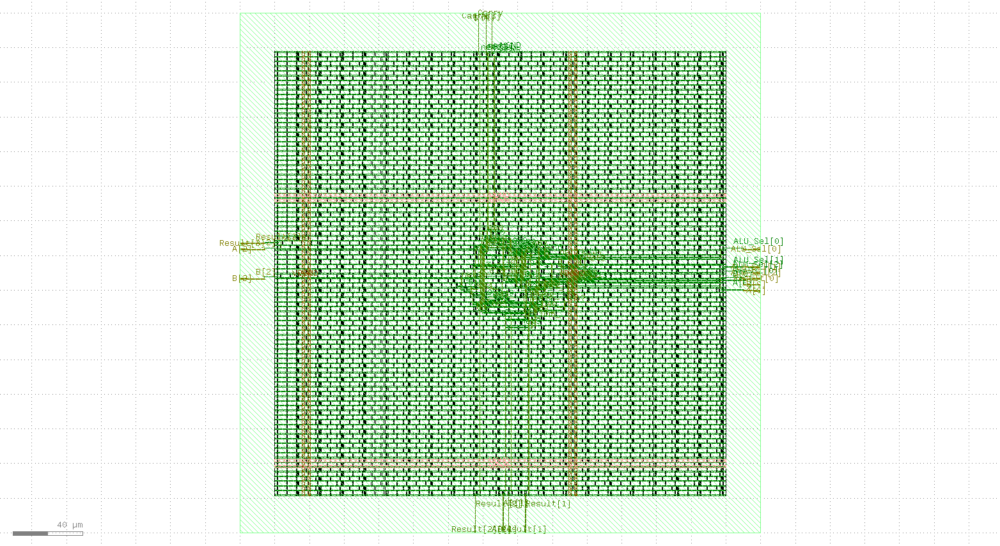

# 4-Bit ALU — RTL to GDSII

A 4-bit combinational Arithmetic Logic Unit (ALU) implemented from Verilog RTL to final GDSII using an open-source ASIC physical design flow.

## Overview

This project demonstrates a complete RTL-to-GDSII physical design flow for a 4-bit combinational ALU using OpenLane 2.

The ALU supports 8 operations selected using a 3-bit control input.

## Final GDSII Layout



## ALU Operations
 ---------------------------
| ALU_Sel   | Operation     |
 ---------------------------
| 000       | Addition      | 
| 001       | Subtraction   |
| 010       | Bitwise AND   |
| 011       | Bitwise OR    |
| 100       | Bitwise XOR   |
| 101       | Bitwise NOT   |
| 110       | Left Shift    |
| 111       | Right Shift   |
 ---------------------------

## Design

### Inputs

- `A` — 4-bit input
- `B` — 4-bit input
- `ALU_Sel` — 3-bit operation select

### Outputs

- `Result` — 4-bit ALU result
- `Carry` — Carry output

## Physical Design Flow

```text
Verilog RTL
     ↓
Synthesis
     ↓
Floorplanning
     ↓
Placement
     ↓
Routing
     ↓
Physical Verification
     ↓
GDSII


Tools Used
-----------
- Verilog
- OpenLane 2
- Yosys
- OpenROAD
- Magic
- KLayout
- Linux / WSL2


Final Results
--------------
 ------------------------------------------
| Metric                 | Result         |
 ------------------------------------------
| Standard-cell count    | 1042           |
| Standard-cell area     | 1770.45 µm²    |
| Core area              | 66,333.6 µm²   |
| Utilization            | 2.669%         |
| Estimated total power  | 46.43 µW       |
| DRC errors             | 0              |
| LVS errors             | 0              |
| Unmatched devices      | 0              | 
| Unmatched nets         | 0              |
| Unmatched pins         | 0              |
 -----------------------------------------


Physical Verification
---------------------
The final routed design was checked using:
- Routing DRC
- Magic DRC
- KLayout DRC
- LVS
- Connectivity checks
- Timing checks
- Power estimation
- Area and utilization analysis


Final physical verification:
----------------------------
DRC : PASS
LVS : PASS


Timing
------
The design is a combinational ALU and does not contain a clock port.

The OpenLane flow reported zero setup and hold violations in the generated timing reports. Since there is no clock in the design, conventional clock-based timing performance such as maximum operating frequency is not specified.

CTS was not performed because the design has no clock port..


Output
------
The final GDSII layout is available at:
  ------------------
 | results/alu4.gds |
  ------------------
Metrics are available at:
  ---------------------
 | results/metrics.csv |
  ---------------------
DRC/LVS summary:
  -----------------------------
 | results/drc_lvs_results.txt |
  -----------------------------

Project Structure
-----------------

4bit-ALU-RTL-to-GDSII/
│
├── rtl/
│   └── alu4.v
│
├── openlane/
│   └── config.json
│
├── results/
│   ├── alu4.gds
│   ├── metrics.csv
│   └── drc_lvs_results.txt
│
├── docs/
│
└── README.md


Key Learning
------------
This project provided hands-on experience with:
- RTL design
- ASIC synthesis
- Floorplanning
- Standard-cell placement
- Routing
- Physical verification
- DRC and LVS
- Timing analysis
- Power estimation
- GDSII generation


Author
------
Hariharan

